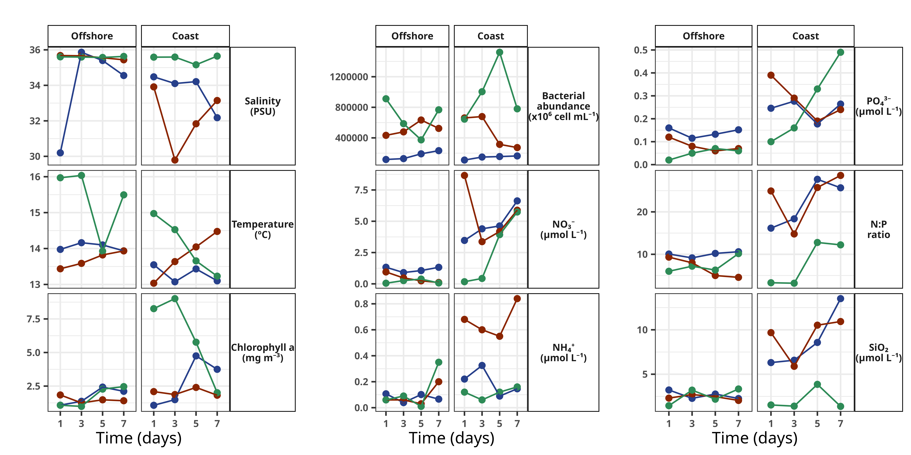
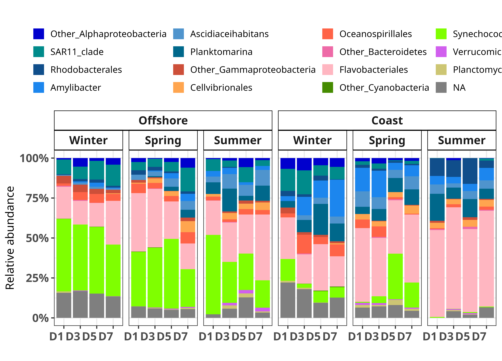

# Coastal upwelling systems (metatranscriptomics)


Reproducible R analyses for studying bacterioplankton functional dynamics across contrasting coastal upwelling conditions.

This repository contains the microbial-community, metatranscriptomic, gene-abundance, and environmental association analyses for the study  
**“Coastal upwelling systems as dynamic mosaics of bacterioplankton functional specialization.”**

The MATLAB oceanography workflows and their CTD and nutrient datasets are maintained separately in [`coastal-upwelling-oceanography`](https://github.com/erickdelgadillo/coastal-upwelling-oceanography).

## Scientific scope

- Bacterioplankton community and functional patterns
- Environmental–community relationships
- Metatranscriptomic analyses
- Gene-abundance and expression ratios
- Redundancy analysis (RDA)
- Reproduction of published and corrected figures

## Representative outputs

The workflows reproduce environmental, community-composition, metatranscriptomic, and functional patterns across contrasting seasonal and coastal–offshore conditions.

### Environmental dynamics

<p align="center">
  
</p>

<p align="center">
  <em>Temporal dynamics of environmental and biological variables across winter, spring, and summer at coastal and offshore stations.</em>
</p>

### Prokaryotic community composition

<p align="center">
  
</p>

<p align="center">
  <em>Relative abundance of major prokaryotic groups across seasons, sampling days, and coastal–offshore conditions.</em>
</p>


Additional representative analyses include:

- [Functional–environmental correlations](figures/functional_environment_correlations.png)
- [Corrected phosphorus-related analysis](figures/phosphorus_correction.png)

## Publication workflows

Three curated R Markdown notebooks are retained under `r_analysis/`:

| Notebook | Scope |
| --- | --- |
| `publication_figures.Rmd` | Revised main workflow for environmental, community, transcriptomic, gene-abundance, ratio, and supplementary plots |
| `figure2_rda.Rmd` | Final RDA panels B–D for Figure 2 |
| `correction_2026.Rmd` | Corrected phosphorus and `pstS` ratio analysis from 2026 |

The notebooks were selected by comparing the historical ENVISION working directory with the final article materials. Older copies, exploratory plots, and unrelated analyses were excluded.

## Run

The input data are stored outside Git. Copy `.Renviron.example` to `.Renviron` and set `COASTAL_UPWELLING_DATA_DIR` to the local data root.

Then start R from the repository root and run the notebooks in this order:

1. `r_analysis/publication_figures.Rmd`
2. `r_analysis/figure2_rda.Rmd` in the same R session
3. `r_analysis/correction_2026.Rmd` independently

`R/paths.R` resolves the configured data root and keeps the active notebooks free of machine-specific paths.

Generated analysis outputs are written under:

```text
r_analysis/Results/Figures/
```

These generated outputs are excluded from Git. A curated subset of representative figures is retained under `figures/` for repository documentation.

## Repository structure

```text
coastal-upwelling-metat/
├── R/
│   └── paths.R                         # Portable external-data path resolver
│
├── figures/                            # Curated representative outputs
│   ├── environmental_dynamics.png
│   ├── functional_environment_correlations.png
│   ├── functional_specialization.png
│   ├── metatranscriptome_composition.png
│   ├── phosphorus_correction.png
│   └── prokaryotic_community.png
│
├── r_analysis/
│   ├── publication_figures.Rmd         # Main publication workflow
│   ├── figure2_rda.Rmd                 # Final RDA panels
│   ├── correction_2026.Rmd             # Corrected 2026 analysis
│   └── README.md
│
├── .Renviron.example
├── DATA.md                             # Input layout and provenance
└── README.md
```

## Data availability

The external `data/r/Calculations/` directory contains 19 compact CSV inputs and three large processed objects.

The large files range from approximately 132 MB to 9.19 GB and are intentionally excluded from Git history. See [`DATA.md`](DATA.md) for the full inventory and configuration details.

Sequence data cited by the article are available from the European Nucleotide Archive:

- `PRJEB36188` — 16S rRNA gene sequences
- `PRJEB36099` — 18S rRNA gene sequences
- `PRJEB36728` (`ERS5513557`–`ERS5513582`) — metatranscriptomes

## Validation status

The three selected notebooks have valid R syntax after extracting their code chunks.

The correction notebook was executed successfully with R 4.3.3. The restored historical main workflow completed end to end using the recovered local inputs, and the RDA workflow completed a functional validation with a reduced permutation count.

The production RDA default remains 999 permutations.

## Associated publications

- Delgadillo-Nuño et al. (2024), *Frontiers in Marine Science*  
  <https://doi.org/10.3389/fmars.2023.1259783>

- Correction (2026), *Frontiers in Marine Science*  
  <https://doi.org/10.3389/fmars.2026.1886620>

## Reproducibility scope

This repository preserves the final available R analysis workflows and their provenance.

It does not include raw sequence data, large processed objects, or the MATLAB oceanography workflow. Those materials are referenced above or maintained in their dedicated repository.

The `figures/` directory contains a curated subset of representative outputs for documentation. Full analysis outputs can be regenerated from the corresponding R Markdown workflows.

## Author

**Erick Delgadillo-Nuño**

Marine microbial ecology · Metatranscriptomics · R · Reproducible scientific workflows
